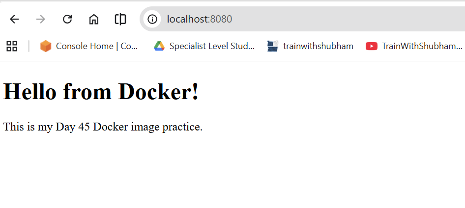

## 1. What is Snipping Tool?

**Snipping Tool** is a built-in Windows app used to take screenshots of your screen.

You can capture:

- Full screen
- One window
- A selected rectangular area
- A freeform selected area

It is useful for saving notes, errors, images, assignments, and computer steps.

---

## 2. Why do we need Snipping Tool?

We use Snipping Tool because it helps us quickly capture information from the screen.

### Common uses

| Use | Example |
|---|---|
| Capture an error | Screenshot of a Windows or software error |
| Save study notes | Screenshot from a webpage or video lecture |
| Share proof | Send a screenshot to teacher or support |
| Create documentation | Add screenshots to assignments or guides |
| Capture a menu | Screenshot of right-click menu or dropdown |

---

## 3. Main Shortcut

The most important shortcut is:

```text
Windows key + Shift + S
```

After pressing this shortcut, the screen becomes dark and you can select the area you want to capture.

---

## 4. Snipping Options

| Option | Meaning |
|---|---|
| Rectangle Snip | Select a rectangular area of the screen |
| Freeform Snip | Draw any shape around the area |
| Window Snip | Capture one open window |
| Fullscreen Snip | Capture the whole screen |

---

## 5. How to Use Snipping Tool with Shortcut

### Steps

1. Open the screen you want to capture.
2. Press:

```text
Windows key + Shift + S
```

3. Choose the snip type.
4. Select the area of the screen.
5. The screenshot is copied automatically.
6. Paste it using:

```text
Ctrl + V
```

You can paste it into:

- Word
- Paint
- Gmail
- WhatsApp
- ChatGPT
- PowerPoint
- Google Docs

---

## 6. How to Open Snipping Tool App

### Steps

1. Click the **Start Menu**.
2. Search for **Snipping Tool**.
3. Open the app.
4. Click **New**.
5. Select the area you want to capture.
6. Save the screenshot if needed.

---

## 7. How to Save a Screenshot

After taking a screenshot, click the **Save icon** or press:

```text
Ctrl + S
```

Then choose a folder such as:

- Desktop
- Downloads
- Pictures
- Documents

---

## 8. How to Take a Delayed Screenshot

A delayed screenshot is useful when you want to capture a menu, dropdown, or right-click option.

### Steps

1. Open **Snipping Tool**.
2. Click the **Delay** option.
3. Choose **3 seconds**, **5 seconds**, or **10 seconds**.
4. Click **New**.
5. Open the menu or dropdown.
6. Take the screenshot.



---

## 9. Useful Keyboard Shortcuts

| Shortcut | Use |
|---|---|
| `Windows + Shift + S` | Start screenshot selection |
| `Ctrl + V` | Paste screenshot |
| `Ctrl + S` | Save screenshot |
| `Windows + PrtScn` | Capture full screen and save automatically |
| `Alt + PrtScn` | Capture active window |

---

## 10. Where are screenshots saved?

If you use:

```text
Windows + PrtScn
```

Windows usually saves the screenshot in:

```text
Pictures > Screenshots
```

If you use:

```text
Windows + Shift + S
```

The screenshot is copied to the clipboard first. You need to paste it or save it manually.


---

## 11. How to Capture Running Work on Screen 

Sometimes a screenshot is not enough. If you want to show **live work**, **moving steps**, or **a process happening on the screen**, you can use the **screen recording** option in Snipping Tool.

This is useful when you want to record:

- A software installation process
- A command running in terminal or PowerShell
- A GitHub Actions workflow running
- A website or app testing process
- Step-by-step troubleshooting
- A moving error or loading screen

### Steps to Record Your Screen

1. Open the work you want to record.
2. Click the **Start Menu**.
3. Search for **Snipping Tool**.
4. Open **Snipping Tool**.
5. Click the **Record** option.
6. Click **New**.
7. Select the area of the screen you want to record.
8. Click **Start**.
9. Do your work on the screen.
10. Click **Stop** when you are finished.
11. Preview the recording.
12. Click **Save** and choose a folder.

<video src="videos/snipping-tool.mp4" controls width="900"></video>


### Important Tips

| Tip | Why it matters |
|---|---|
| Record only the needed area | Keeps the video clean and focused |
| Close personal tabs or files | Protects your private information |
| Speak only if needed | Some recordings may not need audio |
| Keep the video short | Easier for teacher or support to review |
| Save with a clear name | Helps you find it later |

### Example File Names

```text
github-actions-error-recording.mp4
linux-command-output-recording.mp4
software-installation-steps.mp4
assignment-proof-recording.mp4
```

### Screenshot vs Screen Recording

| Use Screenshot When | Use Screen Recording When |
|---|---|
| You need one image | You need to show a full process |
| You want to capture an error message | You want to show how the error happened |
| You need proof of final output | You need to show step-by-step work |
| The screen is not changing | The screen is moving or updating |

---

## 12. Practice Lab 

### Lab 1: Rectangle Snip

1. Open any webpage.
2. Press `Windows + Shift + S`.
3. Select **Rectangle Snip**.
4. Capture only the title area.
5. Paste it into Word or Paint.

### Lab 2: Window Snip

1. Open Calculator or Notepad.
2. Press `Windows + Shift + S`.
3. Select **Window Snip**.
4. Click the open window.
5. Save the screenshot.

### Lab 3: Delayed Snip

1. Open Snipping Tool.
2. Set delay to **5 seconds**.
3. Click **New**.
4. Open a right-click menu.
5. Capture the menu.

---

## 13. Common Problems and Fixes

| Problem | Solution |
|---|---|
| Screenshot disappeared | It may be copied to clipboard. Try `Ctrl + V` in Paint or Word |
| Cannot capture menu | Use the Delay option |
| Screenshot not saved | Press `Ctrl + S` and choose a folder |
| Shortcut not working | Search and open Snipping Tool from Start Menu |

---

## 14. Quick Summary

- Snipping Tool is used to take screenshots.
- The best shortcut is `Windows + Shift + S`.
- Use `Ctrl + V` to paste the screenshot.
- Use `Ctrl + S` to save the screenshot.
- Use Delay when capturing menus or dropdowns.
- Use screen recording to capture running work or step-by-step processes.
- Screenshots and screen recordings help in assignments, documentation, troubleshooting, and learning.

